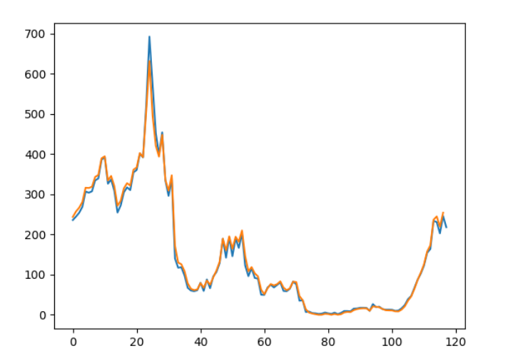
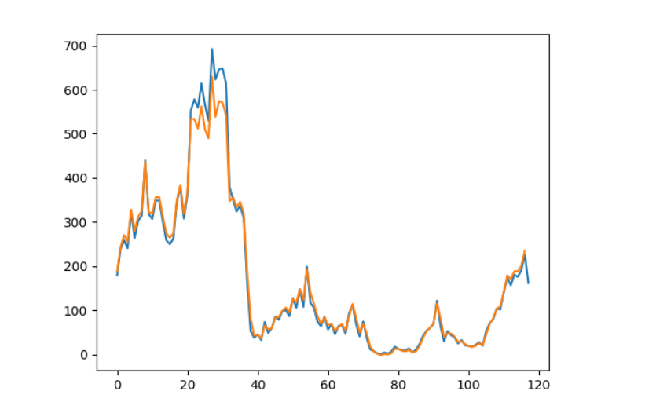

# 热点挖掘：LSTM模型

## 数据集

2022年5月16日到9月12日全国新增确诊人数与新增无症状感染者数量

## 思路

初步想法是直接将前60%的数据制作成训练集，后40%用于预测，偏离预测值较大的即为当天出现热点信息。但由于数据集较小，且通过抽取前几日确诊人数特征预测当日确诊人数，缺乏一定的逻辑合理性，因此，改换思路，将新增无症状感染者数据作为训练集，将新增确诊人数作为测试集，然后再将偏离值较大的选出，作为本次热点分析结果，这是一个朴素的想法，无症状感染者与确诊者有较强的关联性，通过挖掘无症状感染者的数量变化规律可以较好的预测出确诊人数，如若不然，就说明当天有其他因素影响了确诊人数的变化，需要作为热点重点分析。

## 模型

``` python
model = Sequential()
model.add(LSTM(4, input_shape=(None,1)))
model.add(Dense(1))
adam = optimizers.Adam(learning_rate=0.01, beta_1=0.9, beta_2=0.999, amsgrad=False)
model.compile(loss='mean_squared_error', optimizer=adam)
```

| 超参数               | 值   |
| -------------------- | ---- |
| time_step(look_back) | 2    |
| epoch                | 30   |
| batch_size           | 3    |
| learning_rate        | 0.01 |

# 结果

- 蓝线为标签
- 橙线为预测

### 训练结果



``` bash
//loss 收敛
40/40 - 0s - loss: 0.0036 - 343ms/epoch - 9ms/step
Epoch 26/30
40/40 - 0s - loss: 0.0039 - 379ms/epoch - 9ms/step
Epoch 27/30
40/40 - 0s - loss: 0.0035 - 362ms/epoch - 9ms/step
Epoch 28/30
40/40 - 0s - loss: 0.0037 - 335ms/epoch - 8ms/step
Epoch 29/30
40/40 - 0s - loss: 0.0036 - 346ms/epoch - 9ms/step
Epoch 30/30
40/40 - 0s - loss: 0.0039 - 361ms/epoch - 9ms/step
```

### 预测结果



## 热点挖掘

### 结果

``` bash
日期下标 真实值 预测值  偏差百分比
	25 566 	[509] [10.07067138]
	28 623 	[538] [13.64365971]
	29 646 	[574] [11.14551084]
	30 648 	[570] [12.03703704]
	31 614 	[541] [11.88925081]
	37 162 	[189] [16.66666667]
	38 53 	[81] [52.83018868]
	39 38 	[42] [10.52631579]
	42 74 	[65] [12.16216216]
	43 49 	[57] [16.32653061]
	51 106 	[117] [10.37735849]
	53 108 	[123] [13.88888889]
	55 117 	[140] [19.65811966]
	57 75 	[86] [14.66666667]
	60 56 	[67] [19.64285714]
	62 46 	[53] [15.2173913]
	65 47 	[53] [12.76595745]
	68 69 	[83] [20.28985507]
	69 41 	[49] [19.51219512]
	71 38 	[48] [26.31578947]
	72 12 	[18] [50.]
	73 8 	[7] [12.5]
	74 3 	[2] [33.33333333]
	75 1 	[-1] [200.]
	76 5 	[1] [80.]
	77 2 	[0] [100.]
	78 6 	[3] [50.]
	79 18 	[13] [27.77777778]
	81 10 	[8] [20.]
	82 9 	[7] [22.22222222]
	83 13 	[10] [23.07692308]
	85 11 	[7] [36.36363636]
	86 23 	[18] [21.73913043]
	87 42 	[37] [11.9047619]
	92 65 	[82] [26.15384615]
	93 30 	[39] [30.]
	97 25 	[28] [12.]
	102 22 	[19] [13.63636364]
	105 54 	[45] [16.66666667]
```


